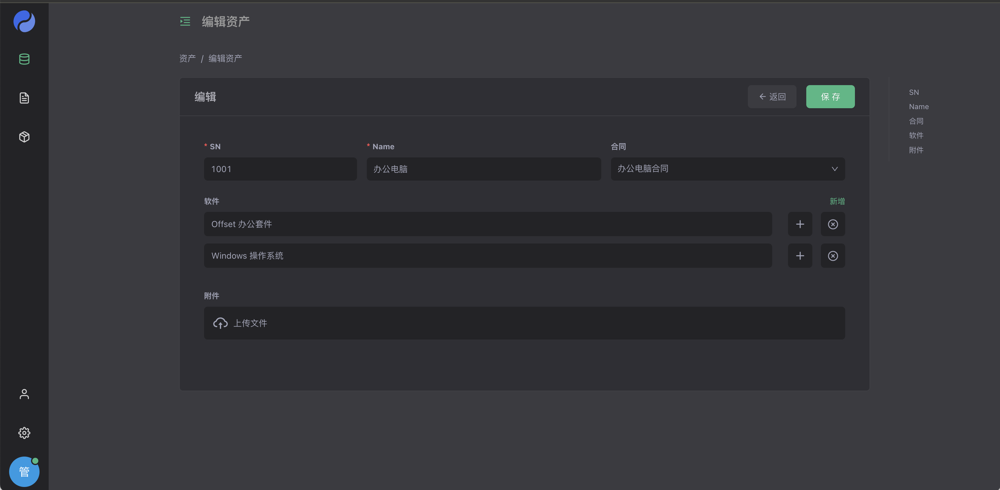

[中文介绍](README.zh-CN.md)

Asset Management Sytem Demo

Documentation: [https://yaoapps.com/en-US/doc](https://yaoapps.com/en-US/doc/Introduction/Getting%20Started)

## USAGE

### Docker

```bash
docker run -d -p 5099:5099 --restart unless-stopped \
    -e YAO_INIT=demo \
    -e YAO_PROCESS_RESET=flows.setmenu \
    yaoapp/demo-asset:1.0.1-amd64
```

### Yao

#### Download source code

```bash
git clone https://github.com/YaoApp/demo-asset /app/path/asset

```

#### Set the environment variables

```bash

mkdir /app/path/asset/db
mkdir /app/path/asset/data
mkdir /app/path/asset/logs

cat << EOF
YAO_ENV=development # development | production
YAO_ROOT="/app/path/asset"
YAO_HOST="0.0.0.0"
YAO_PORT="5099"
YAO_SESSION="memory"
YAO_LOG="/app/path/asset/logs/application.log"
YAO_LOG_MODE="TEXT"  #  TEXT | JSON
YAO_JWT_SECRET="bLp@bi!oqo-2U+hoTRUG"
YAO_DB_DRIVER=sqlite3 # sqlite3 | mysql
YAO_DB_PRIMARY="/app/path/asset/db/yao.db"
EOF > /app/path/asset/.env
```

#### Initialization

```bash
cd /app/path/asset
# Create tables & set menu
yao migrate --reset
yao run flows.setmenu
```

#### Start the service

```bash
cd /app/path/asset
yao start
```

## ADMIN

Open the browser to visit the URL:

http://127.0.0.1:5099/xiang/login/admin

User Name: `xiang@iqka.com`
Password: `A123456p+`
